# Bare Metal Library Example Projects
This document describes how to use the SoftConsole example projects included in
the PolarFire SoC Bare Metal Library.

## Important Note About SoftConsole Workspace
SoftConsole includes an empty workspace. We recommend that you make a copy of
this empty workspace to a location of your choice. This will allow you to take
advantage of the integrated "develop and debug" perspective, Renode platform
launchers and other pre-configured settings.

Using the empty workspace as a starting point for your own workspace allows the
example projects to work out of the box. In particular the Renode debug launchers
included in the example projects will refer to the correct Renode external tool
launchers.

The empty workspace is located under the following path of your SoftConsole
installation:

    ./extras/workspace.empty

## Importing Example Projects Into Your SoftConsole Workspace
SoftConsole example projects are included in the following folder of the of the
Bare Metal Library: mpfs-bare-metal-library/examples

- Select the File->Import menu to import an example project into your SoftConsole
Workspace:

   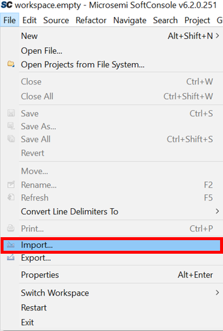

- Expand "Git" -> "Projects from Git (with smart import)" and click "Next":

   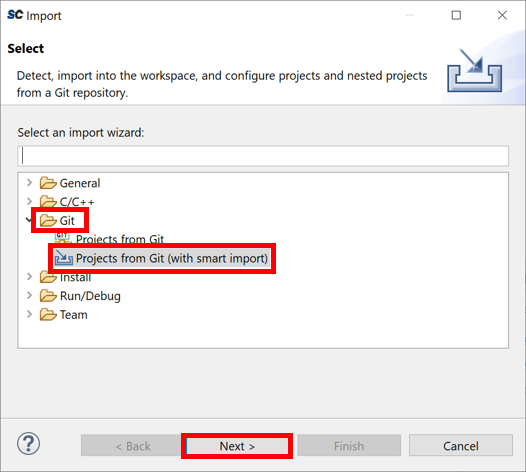
   
   
- Select "Clone URL" and click "Next":

   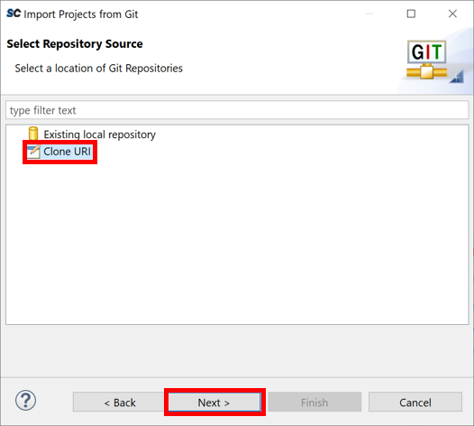
   

- Copy the link to the PolarFire SoC Bare Metal Library GitHub repository:

   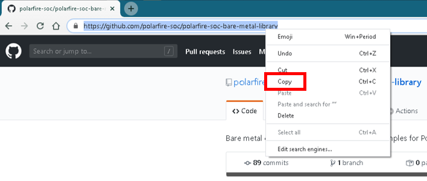   
   

- Paste the link to the PolarFire SoC Bare Metal Library GitHub repository into the "URL" field, others will auto populate, and click "Next":

   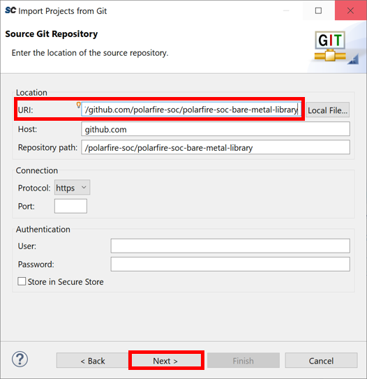

- Ensure the "Master" branch is selected and click "Next":

   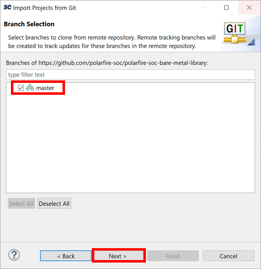   
   
   
- Select a destination folder to clone the bare metal library to and click "Next":

   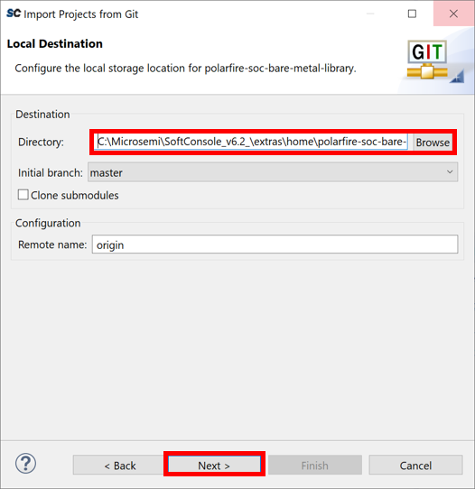    
   
   
- Allow SoftConsole to clone the bare metal library:

   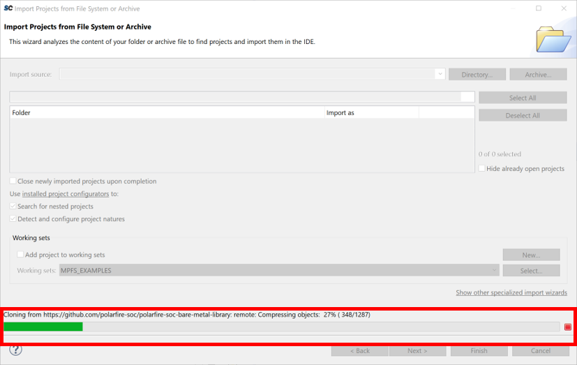       
   
   
- Use the "Deselect All" option to deselect all of the included projects and only import the required project and click "Finish":

   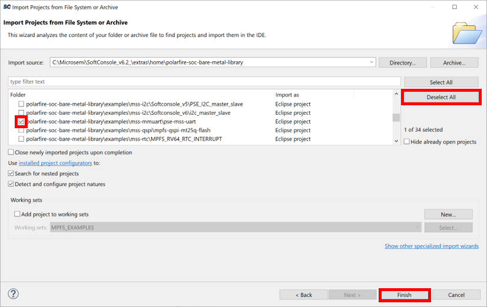       
   
   
- The imported project will now appear in the project explorer and the "polarfire-soc-bare-metal-libray" will now appear as a git repository:

   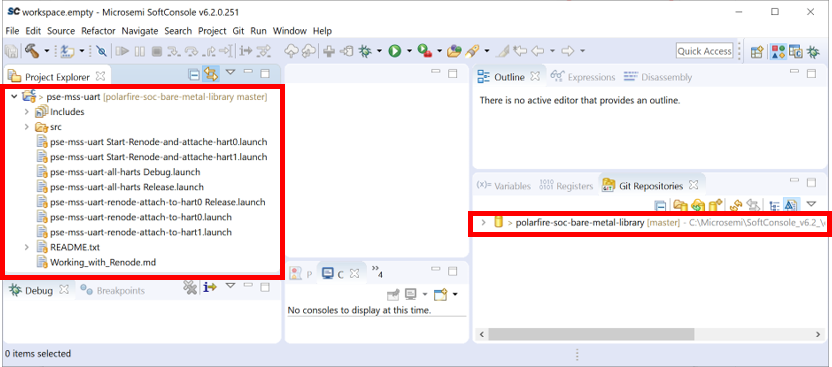          
   

- Further projects can be imported following these steps, as the bare metal library is already cloned, the projects can be imported from a local repository instead of a URL
   
   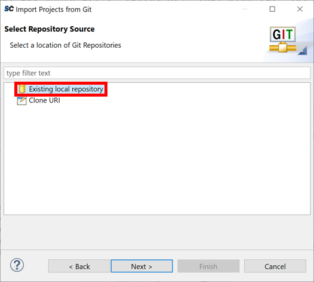     
   

## Executing/Debugging Examples In Renode
Most example projects include a Renode debug launcher allowing execution of the
example projects in the Renode virtual platform.

- Open the project and build it using the "Build" button:

   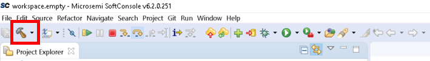

- Click on the down-arrow on the right of the "Debug" button then click on "Debug Configurations":

   

- Select a Renode launcher in the "Launch Group" list then click "debug":

   

- This will launch Renode and some Renode analyzers allowing you to interact with the executing example code:

   

- The debug perspective reflects the debug operations:

   

- The debug execution is controlled using the debug buttons:

   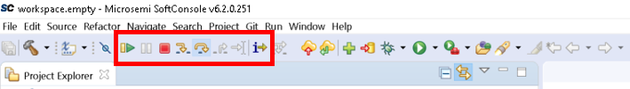

